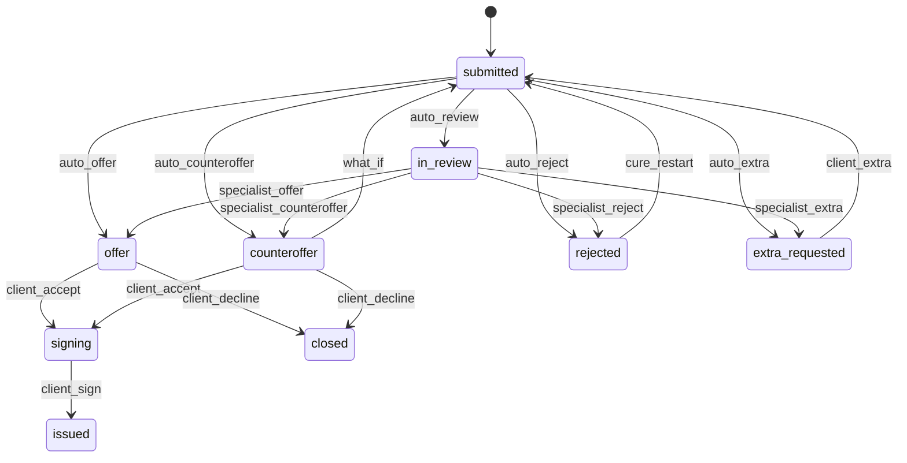

# Диаграмма состояний заявки

```mermaid
stateDiagram-v2
  [*] --> submitted
  submitted --> offer: auto_offer
  submitted --> counteroffer: auto_counteroffer
  submitted --> rejected: auto_reject
  submitted --> in_review: auto_review
  submitted --> extra_requested: auto_extra
  extra_requested --> submitted: client_extra
  in_review --> offer: specialist_offer
  in_review --> counteroffer: specialist_counteroffer
  in_review --> rejected: specialist_reject
  in_review --> extra_requested: specialist_extra
  offer --> signing: client_accept
  counteroffer --> signing: client_accept
  offer --> closed: client_decline
  counteroffer --> closed: client_decline
  counteroffer --> submitted: what_if
  signing --> issued: client_sign
  rejected --> submitted: cure_restart
```

Новая заявка создаётся только после финального отказа или закрытия. Дозапрос, встречка, Cure ФНС и What-If живут на том же `id`.
